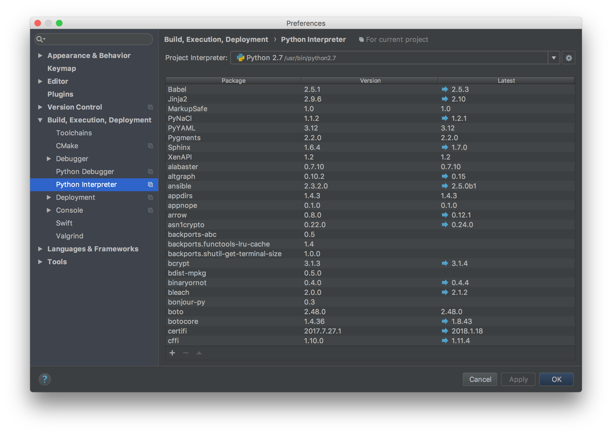
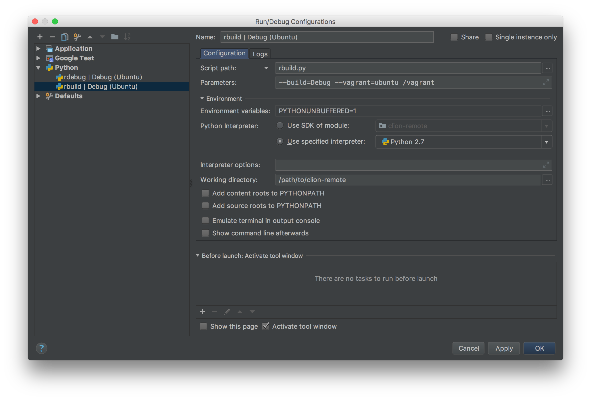

=============================
Remote Development With CLion
=============================

.. _remote development: https://youtrack.jetbrains.com/issue/CPP-744
.. _remote debugging: https://www.jetbrains.com/help/clion/remote-debug.html

`Remote development`_ support in CLion is still evolving. As of version 2017.3
there is `remote debugging` support, but no remote project support. This
project is a demonstration of how to use CLion and Vagrant for remote
development.

Project Configuration
=====================

Initial Setup
-------------
1. Clone this project.

.. code-block:: shell

    $ git clone https://github.com/mdklatt/clion-remote.git

2. Open the project in CLion.

3. Define a Python interpreter for the project.

|python|

Remote Builds
-------------

4. Run the build script to configure CMake. The Vagrant box will be started and
   provisioned as necessary.

.. code-block:: shell

    $ python rbuild.py --config --vagrant=ubuntu /vagrant

5. Create a Run Configuration for the build script

|rbuild|
