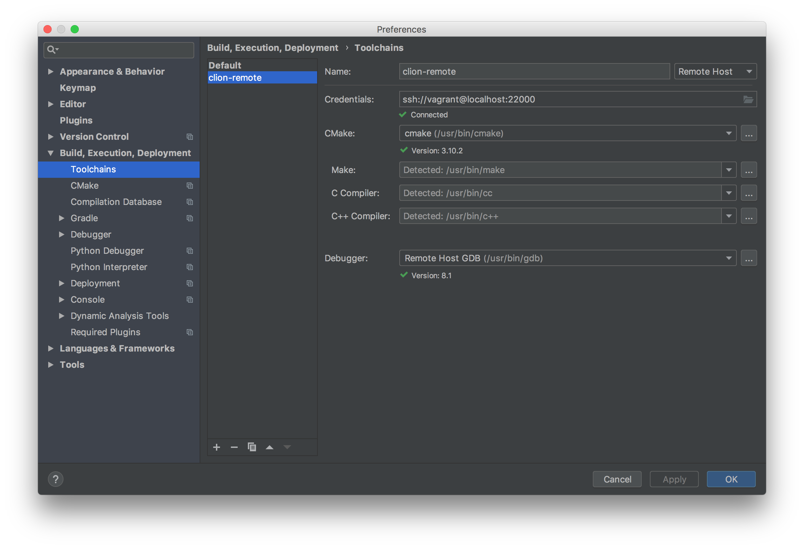
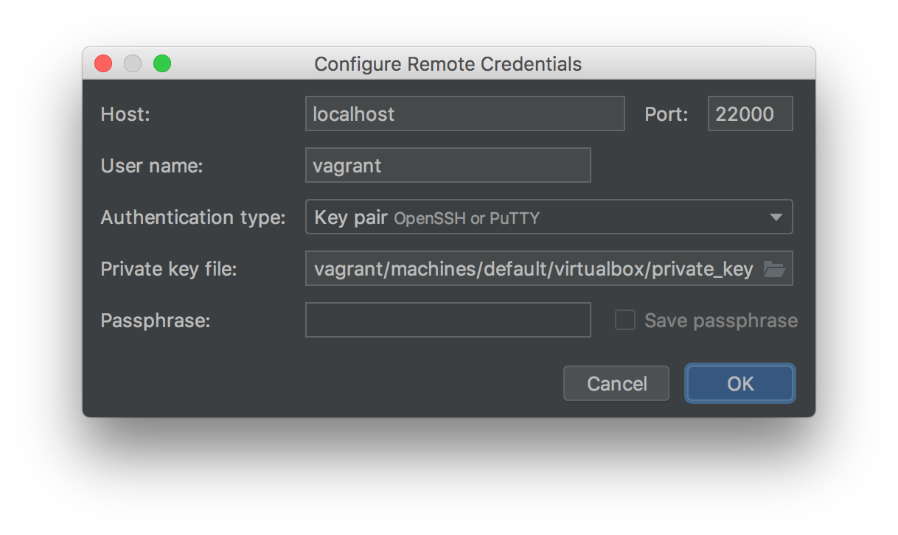
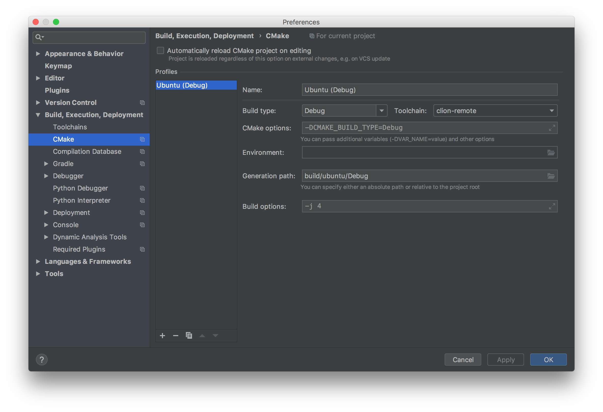
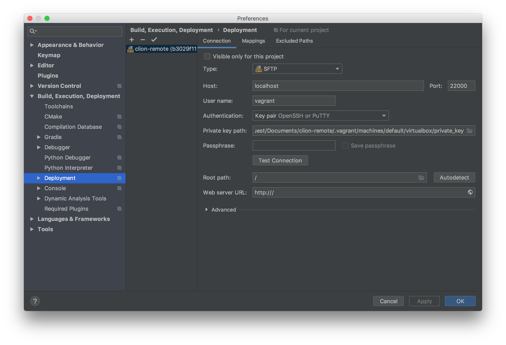
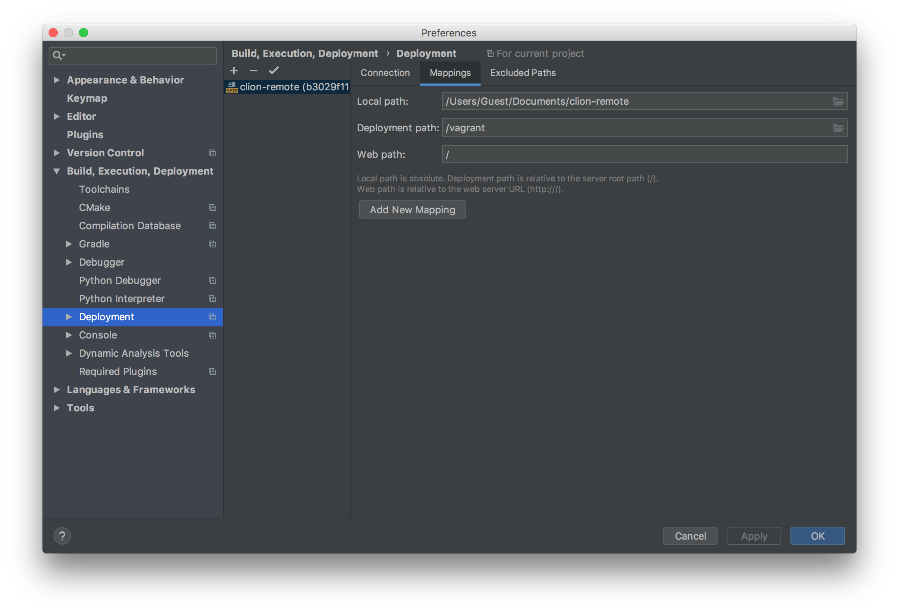
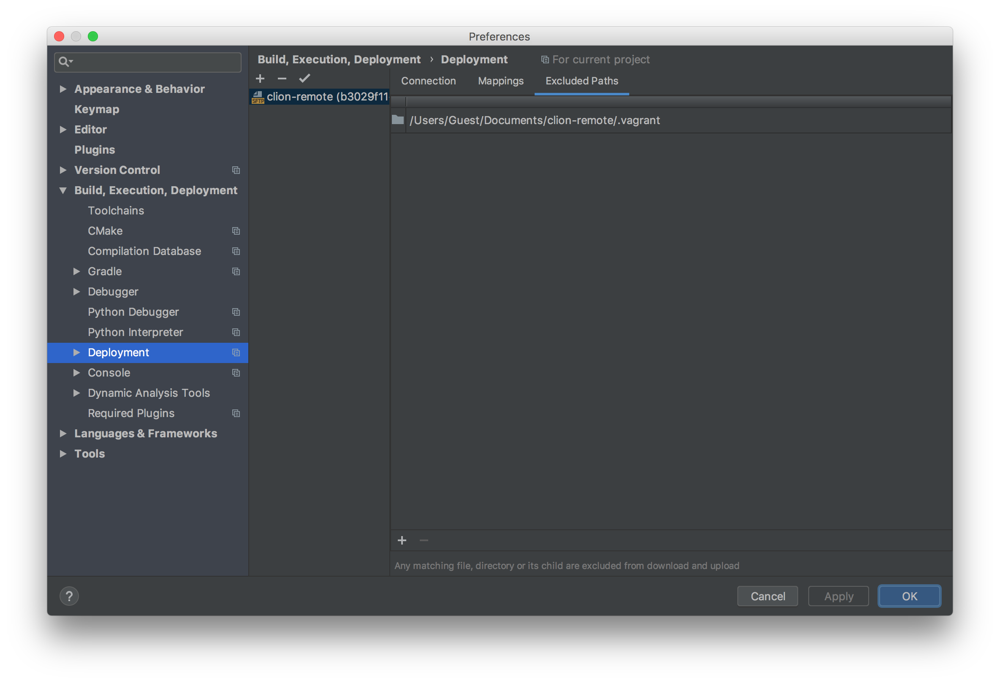
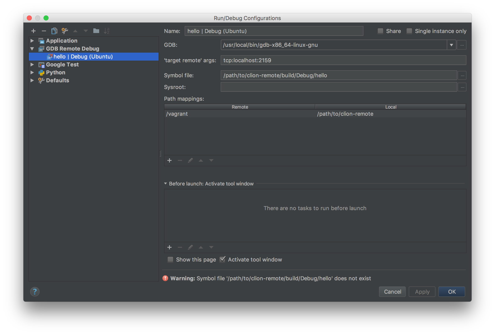
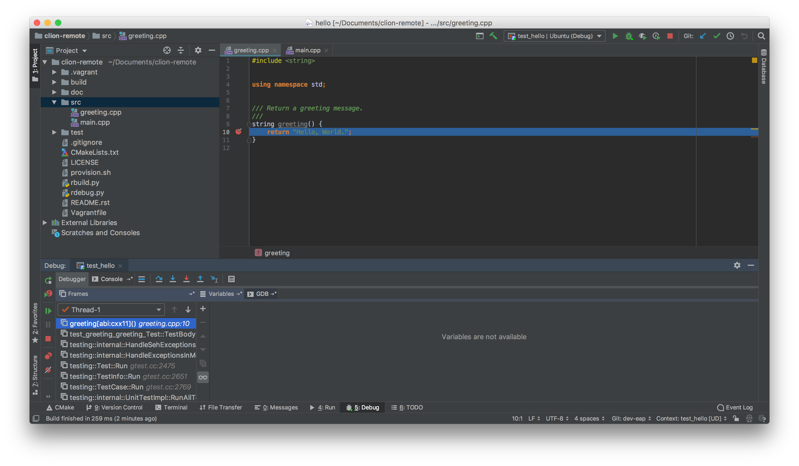

#########################################
Remote Development With CLion and Vagrant
#########################################

.. _remote development: https://www.jetbrains.com/help/clion/remote-development.html
.. _Vagrant: https://www.vagrantup.com
.. _Vagrant support: https://youtrack.jetbrains.com/issue/CPP-7671
.. _Python: doc/python.rst

This project is an example of using the CLion `remote development`_ features
with a `Vagrant`_ VM as the remote host. CLion does not have `Vagrant support`_
yet, so some modifications to the standard Vagrant workflow are necessary; see
the project ``Vagrantfile``.

See `Python`_ for using CLion to run remote Python applications.

=============
Initial Setup
=============

1. Clone this project.

2. Start and provision the Vagrant box. Note the connection port and remote
project directory in the Vagrant start-up messages.

.. code-block:: shell

    $ vagrant up

    ...

    ==> default: CLion workarounds enabled
    ==> default: Use port 22000 for CLion remote host connection
    ==> default: Use /vagrant as the remote deployment directory

=====================
Project Configuration
=====================

.. _static IP: https://www.vagrantup.com/docs/networking/private_network.html#static-ip
.. _mounted folders: https://youtrack.jetbrains.com/issue/CPP-14887

3. Define a Toolchain to configure the build and debug tools for the Vagrant
   box. Here, a fixed SSH port is used to connect. A `static IP`_ can be
   instead. In either case, the address must be unique on the local machine.

   |Toolchains|

   Use the Vagrant private key file for this connection.

   |Credentials|

   Once the Toolchain is configured, hit ``Apply`` to create it.

4. Define one or more CMake Profiles to configure the build types to use with
   the Vagrant Toolchain.

   |CMake|

5. When a remote Toolchain is created, CLion will create the corresponding SFTP
   deployment. CLion does not yet support `mounted folders`_ for remote builds,
   so a Vagrant synced folder cannot be used for the project directory.

   |Deployment|

   The local project is directory is mapped to ``/vagrant`` on the VM. Here,
   CLion will manage the remote directory, not Vagrant. Files in the project
   directory **cannot be used during Vagrant provisioning** because they will
   not be synced to the VM at that point.

   |Mappings|

   CLion will automatically exclude the local build directory from syncing, but
   all other exclusions must be manually configured. The local ``.vagrant/``
   directory should be excluded along with any other files that are not needed
   to build or run the project.

   |Excluded|

===============
Remote Workflow
===============

Once the project is properly configured, CLion will sync files to the Vagrant
VM and run CMake to build the project model. Run/Debug Configurations will be
created for all of the project executables.

|hello|

CLion can now be used to edit, build, debug, and test the project as if it was
on the local machine.

|debug|

Project binaries built on the remote machine will be available in the local
copy of the build directory.

===============
Troubleshooting
===============

.. _YouTrack: https://youtrack.jetbrains.com/issues/CPP
.. _CPP-744: https://youtrack.jetbrains.com/issue/CPP-744

Use `YouTrack`_ to report new bugs, find workarounds for existing bugs, and
make feature requests. `CPP-744`_ is the parent for remote development issues.

If CLion loses connection with the VM, run ``Tools->Resync with Remote Hosts``.
If that option is not available, run ``Tools->CMake-Reload CMake Project``.

It is possible for the project to get into an inconsistent state that will
disrupt file syncing. In some cases, CLion will be unable to sync updated build
files from the remote machine to the local machine. In other cases, CLion will
stop syncing local source files to the remote machine. If this occurs, try
these other troubleshooting options:

- Run ``Tools->CMake->Reset Cache and Reload Project``
- Run ``Tools->Deployment->Upload to...``
- Remove the file ``/vagrant/.clion.source.upload.marker`` from the VM
- Run ``File->Invalidate Caches / Restart``
- Restart the Vagrant VM
