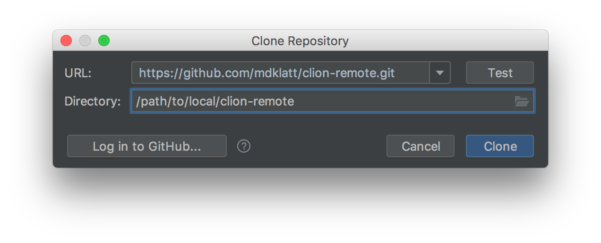
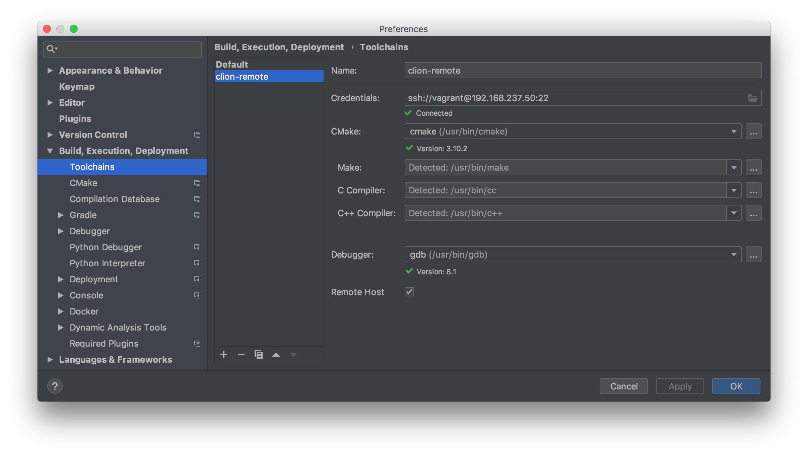
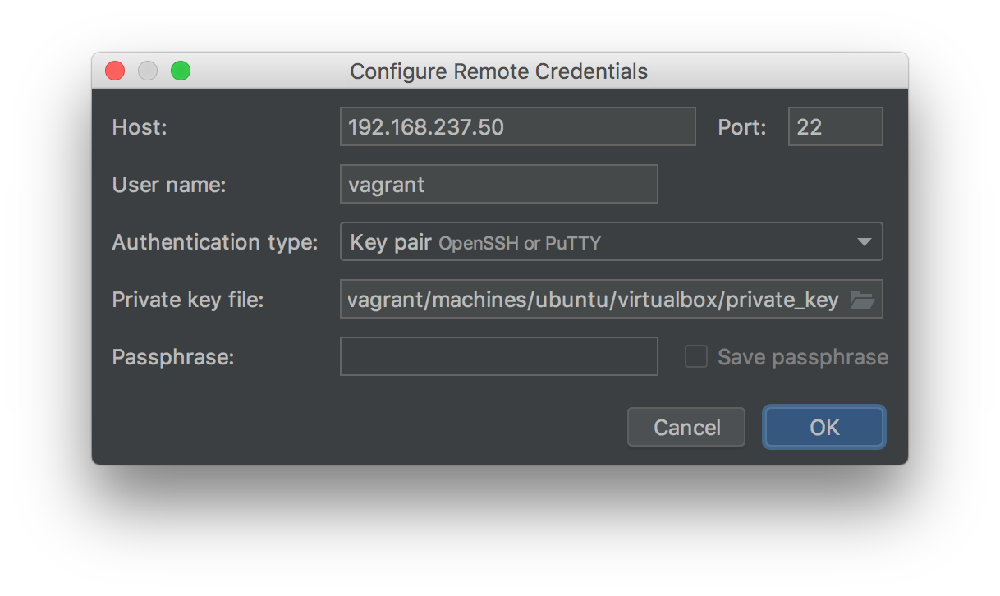
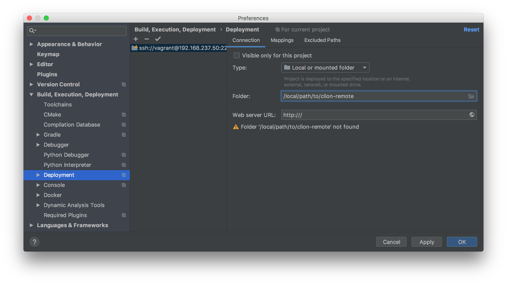
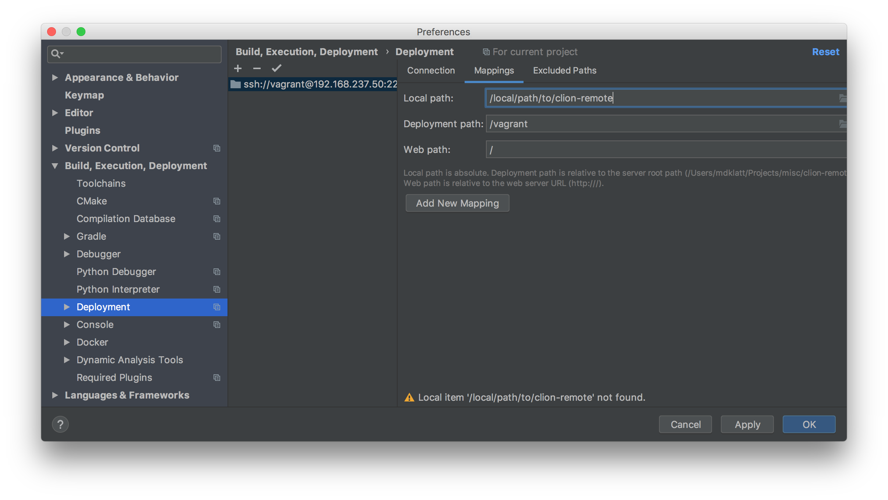
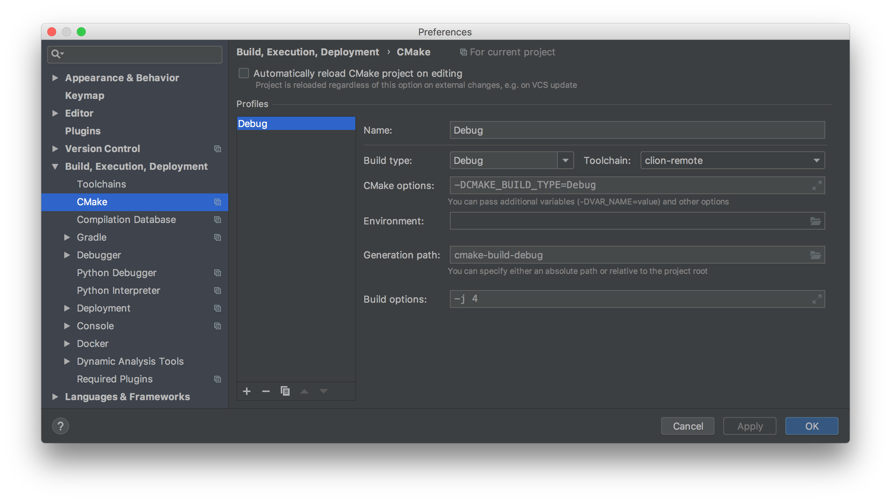

#########################################
Remote Development With CLion and Vagrant
#########################################

.. _2018.3 EAP: https://blog.jetbrains.com/clion/2018/09/initial-remote-dev-support-clion
.. _remote development: https://youtrack.jetbrains.com/issue/CPP-744
.. _Vagrant support: https://youtrack.jetbrains.com/issue/CPP-7671

.. _early implementation of remote development:

With the `2018.3 EAP`_ release, CLion now implements `remote development`_,
which allows local editing and remote building and debugging from the IDE.
There is no integrated `Vagrant support`_ yet, but projects can be manually
configured to approximate this.

The Vagrant box must be Linux, and it must have ``rsync`` and a recent version
of GDB (7.8+). Newer versions of Ubuntu include a compatible version of GDB in
their standard package repos, but CentOS users will have to build a version
from source.

=============
Initial Setup
=============

1. Clone this project using the ``Check out from Version Control`` option.

|clone|

2. Checkout the ``dev-eap`` branch.

3. Start and provision the Vagrant box.

.. code-block:: shell

    $ vagrant up ubuntu

=====================
Project Configuration
=====================

4. Create a new Toolchain for the Vagrant box. Check the Remote Host option to
   bring up the login credentials dialog. Use the static IP address assigned to
   the Vagrant box in the project Vagrantfile (this IP address must be unique
   on the local private network). As configured for this project, the path to
   the Vagrant SSH key will be
   ``/local/path/to/clion-remote/.vagrant/machines/ubuntu/virtualbox/private_key``.
   Hit ``Apply`` to save the changes.

|toolchain|

|login|

5. When a remote Toolchain is created, CLion will automatically create an SFTP
   Deployment the remote host. For a Vagrant box, it is better to use a Vagrant
   shared folder. Choose the Deployment for the ``remote-host`` Toolchain (note
   the IP address), change the type to ``Local or mounted folder``, and add a
   Mapping to link the local project directory to ``/vagrant`` on the Vagrant
   box. Hit ``Apply`` to save the changes.

|deployment|

|mapping|

6. Create one or more CMake Profiles for the Vagrant box. Choose the
   `clion-remote` Toolchain that was configured above. Hit ``OK`` to initiate
   the remote configuration process.

|cmake|

====================
Development Workflow
====================

Once a remote CMake Profile is properly configured, CLion will sync the project
to the remote host (not necessary with a shared folder deployment) and run the
remote CMake. CLion can now be used to edit, build, debug, and run tests for
the project as if it was on the local machine. Project binaries will be created
in the generation path configured for the build Profile, *.i.e.*
``/local/path/to/clion-remote/cmake-build-debug``.

===============
Troubleshooting
===============

.. _YouTrack: https://youtrack.jetbrains.com/issues/CPP

This is a beta release with many known issues. Use `YouTrack`_ to find
workarounds to existing bugs, report new bugs, and make feature requests.

Toolchain configurations are based on a fixed host address, which is often not
the case with Vagrant boxes. Here, a static IP address is used as a workaround.
An alternative is to assign each Vagrant box a fixed SSH port. This requires
some extra work to ensure that each Vagrant box is uniquely addressable. DO NOT
use Vagrant's auto-correct feature.

CLion uses the local user's SSH configuration, including the ``known_hosts``
file. A new remote Toolchain cannot be successfully created if a host key
already exists for that address. An existing Toolchain will stop working if the
host key for the remote host changes; this is a particular problem for Vagrant
development because a Vagrant box gets a new host key every time it is
initialized. If a remote Toolchain is not working, try deleting any host keys
with the Vagrant box's address.

CLion has a tendency to forget Toolchain configuration values. If a custom
tool path is configured, *e.g.* ``/usr/local/bin/gdb``, it will eventually
revert back to its default value. It will be necessary to set the path to
the correct value again.

CLion will also forget the Remote Host settings for a Toolchain. This is more
problematic. The settings have to be entered again, which will create a new
SFTP Deployment that also has to be reconfigured to use a shared folder. Any
old Deployments for this address are not removed, so there may be more than
one orphaned Deployments identified with the same address.

It's possible to use SFTP Deployments with Vagrant boxes, but this is not
recommended. The time on the Vagrant box can fall behind the host computer,
which may prevent project files from being synced correctly.

.. _CPP-14315: https://youtrack.jetbrains.com/issue/CPP-14315
.. _CPP-14317: https://youtrack.jetbrains.com/issue/CPP-14317
.. _CPP-14328: https://youtrack.jetbrains.com/issue/CPP-14328

- `CPP-14315`_: Remote toolchains lose their ssh config on CLion restart
- `CPP-14317`_: Changed files not downloaded to target after setting target clock
- `CPP-14328`_: Remote toolchain loses custom GDB setting
