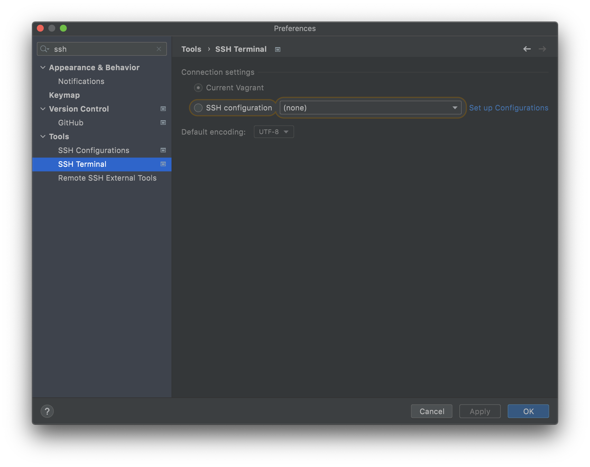
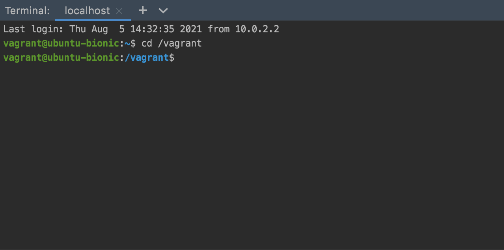
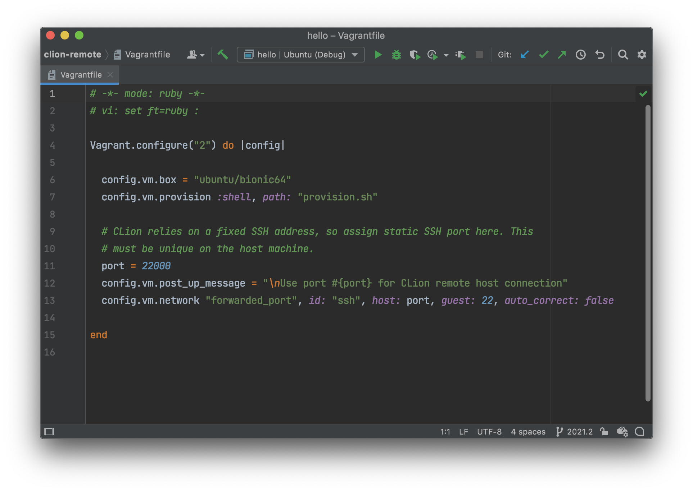

#########################################
Remote Development With CLion and Vagrant
#########################################

This project is an example of using the CLion `remote development`_ features
with a `Vagrant`_ VM as the remote host.

This is for CLion 2021.2, which includes some important features for Vagrant
support. Users of older versions should refer to the `main branch`_.

=============
Initial Setup
=============

1. Clone this project.

2. Start and provision the Vagrant box. Note the connection port in the Vagrant
   start-up messages.

.. code-block:: shell

    $ vagrant up

    ==> default: Machine 'default' has a post `vagrant up` message. This is a message
    ==> default: from the creator of the Vagrantfile, and not from Vagrant itself:
    ==> default:
    ==> default:
    ==> default: Use port 22000 for CLion remote host connection

=====================
Project Configuration
=====================

.. |Toolchains| image:: doc/image/Toolchains.png
   :alt: Toolchains

.. |Credentials| image:: doc/image/Credentials.png
   :alt: Remote Host Credentials

.. |CMake| image:: doc/image/CMake.png
   :alt: CMake Profiles

.. |Deployment| image:: doc/image/Deployment.png
   :alt: Remote Deployment

3. Define a Toolchain to configure the build and debug tools for the Vagrant
   box. Here, a fixed SSH port is used to connect. A `static IP`_ address can
   be instead. In either case, the address must be unique on the local machine.

   |Toolchains|

   Use the Vagrant private key file for this connection.

   |Credentials|

   Once the Toolchain is configured, hit ``Apply`` to create it.

4. Define one or more CMake Profiles to configure the build types to use with
   the Vagrant Toolchain.

   |CMake|

5. When a remote Toolchain is created, CLion will create an SFTP deployment
   by default. This should be changed to a `Local or mounted folder`_ for use
   with Vagrant. The local path is the project directory and the remote path is
   the synced folder configured in your Vagrantfile (``/vagrant`` by default).
   There is no need to configure any excluded paths.

   |Deployment|

===============
Remote Workflow
===============

.. |hello| image:: doc/image/hello.png
   :alt: hello Run/Debug Configuration

.. |debug| image:: doc/image/debug.png
   :alt: hello Run/Debug Configuration

Once the project is properly configured, CLion will run CMake on the Vagrant VM
to build the project model. Run/Debug Configurations will be created for all of
the project executables.

|hello|

CLion can be used to edit, build, debug, and test the project as if it was on
the local machine.

|debug|

Project binaries built on the remote machine will be available locally in the
mounted build directory.

Selecting the new ``Current Vagrant`` option (undocumented) in the SSH Terminal
settings will allow CLion to automatically connect to the local Vagrant VM when
opening a `remote host terminal`_.

|ssh-vagrant|

|terminal|

Another new Vagrant feature is basic syntax coloring for Vagrantfiles.

|Vagrantfile|

===============
Troubleshooting
===============

Use `YouTrack`_ to report new bugs, find workarounds for existing bugs, and
make feature requests. `CPP-744`_ is the parent for remote development issues.

If CLion loses connection with the VM, run ``Tools->Resync with Remote Hosts``.
If that option is not available, run ``Tools->CMake->Reload CMake Project``.

Using a mounted folder should significantly decrease file syncing issues when
using Vagrant, but this is still under development and has some rough edges
(*e.g.* `CPP-14887`_).

Under some circumstances, CLion will silently create a new SFTP Deployment for
a remote Toolchain. Any time this happens, the new Deployment needs to be
edited to use a `Local or mounted folder`_ as described above. It is usually
not obvious at first when this happens, but file syncing issues may become
apparent until new Deployment is fixed.

CLion will not automatically remove old Deployments, so a project may
accumulate a number of orphaned Deployment configurations. The UID in the
Deployment name will match the UID in the Toolchain name *only if this is the
first Deployment created for that Toolchain*. Once that Deployment has been
orphaned the UID is no longer helpful in determining which Deployment is active
for the project. There is a `feature request`_ that will help with this.

.. _remote development: https://www.jetbrains.com/help/clion/remote-development.html
.. _Vagrant: https://www.vagrantup.com
.. _Vagrant support: https://youtrack.jetbrains.com/issue/CPP-7671
.. _Python: doc/python.rst
.. _YouTrack: https://youtrack.jetbrains.com/issues/CPP
.. _CPP-744: https://youtrack.jetbrains.com/issue/CPP-744
.. _static IP: https://www.vagrantup.com/docs/networking/private_network.html#static-ip
.. _CPP-14887: https://youtrack.jetbrains.com/issue/CPP-14887
.. _Local or mounted folder: https://www.jetbrains.com/help/clion/remote-projects-support.html#deployment-entry
.. _main branch: https://github.com/mdklatt/clion-remote
.. _remote host terminal: https://www.jetbrains.com/help/clion/remote-host-terminal.html
.. _feature request: https://youtrack.jetbrains.com/issue/CPP-25579