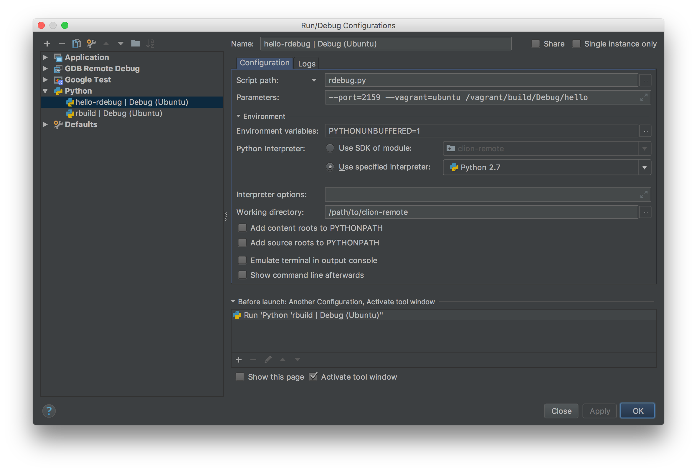
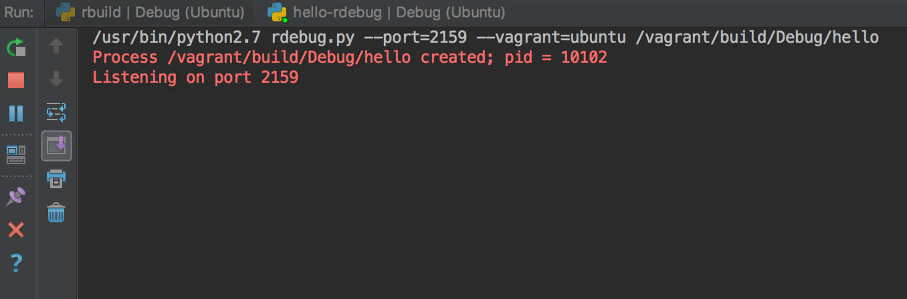
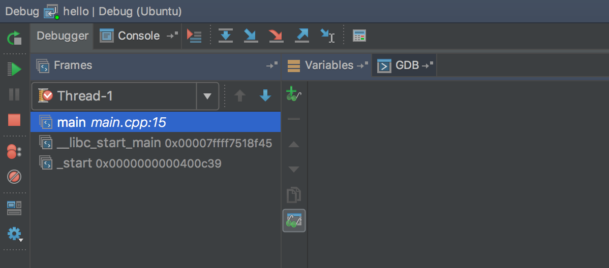

#############################
Remote Development With CLion
#############################

.. _remote development: https://youtrack.jetbrains.com/issue/CPP-744
.. _remote debugging: https://www.jetbrains.com/help/clion/remote-debug.html
.. _2018.2 roadmap: https://blog.jetbrains.com/clion/2018/04/clion-2018-2-roadmap/

`Remote development`_ support in CLion is evolving. As of version 2018.1 there
is `remote debugging`_ support, and prototype remote development support is in
the `2018.2 roadmap`_.

This project is an example of using CLion in its current state for remote
development with Vagrant.

=====================
Project Configuration
=====================

Initial Setup
=============
1. Clone this project.

.. code-block:: shell

    $ git clone https://github.com/mdklatt/clion-remote.git

2. Open the project in CLion.

3. Define a Python interpreter for the project.

.. |python| image:: doc/image/python.png
   :alt: Python Interpreter configuration

|python|

4. Start and provision the Vagrant box, and configure the remote project.

.. code-block:: shell

    $ vagrant up ubuntu
    $ python rbuild.py --config --vagrant=ubuntu /vagrant

Remote Builds
=============

5. Create a Python run configuration for the build script. This is used to run
   CMake on the Vagrant box to build the project.

.. |rbuild| image:: doc/image/rbuild.png
   :alt: Run Configuration for rbuild.py

|rbuild|

Remote Debugging
================
.. _cross debugging: https://sourceware.org/gdb/wiki/BuildingCrossGDBandGDBserver
.. _bundled GDB: https://www.jetbrains.com/help/clion/run-debug-configuration-remote-gdb.html

6. Install a local version of GDB that supports `cross debugging`_ for the
   Vagrant box architecture. If you are using CLion 2018.1 or higher use the
   `bundled GDB`_, which has multiarch support.

7. Create a Python run configuration for the remote debugging script. This is
   used to run an executable on the Vagrant box using ``gdbserver``. The port
   corresponds to the *guest* port number being forwarded on the Vagrant box.
   Note that the build configuration created above is added as a
   *Before launch* prerequisite.

|rdebug|

8. Create a GDB Remote Debug run configuration for the remote executable. This
   is used to run the ``gdb`` cross debugger in concert with ``gdbserver`` on
   the Vagrant box. The port number corresponds to the *host* number being
   forwarded to the Vagrant box.

.. |hello| image:: doc/image/hello.png
   :alt: Run Configuration for hello

|hello|

===========================
Remote Development Workflow
===========================

With a normal CLion project, everything is local. Source files are edited
on the machine where CLion is running, compiled with the local CMake tool
chain, and executed and debugged as a local binary. CLion automatically manages
CMake and rebuilds the project as necessary. Code assistance features use the
local tool chain and locally installed dependencies.

With a Vagrant workflow, source files are edited locally, but compiled and
executed remotely on the Vagrant box. CLion cannot run executables remotely,
but it can debug a remote executable. CLion cannot run the remote version of
CMake, so it cannot automatically build the project. Code assistance will not
work as expected, especially features that depend on the compiler or any
dependencies that are not available locally.

If the project is configured as described above, editing, building, testing,
and debugging can be done in the IDE without needing to SSH to the Vagrant
box.

Editing
=======

The local project directory is synced with the Vagrant box, so editing is the
same as with a normal project. This includes the Git workflow, because the repo
is still local. There is no need to deploy files to the Vagrant box.

Building
========

Use the *rbuild* run configuration to build the project. This can be run by
itself, or used as a prerequisite of another run configuration to ensure that
the project is always rebuilt. Output is displayed in the Run window.

.. |build| image:: doc/image/build.png
   :alt: rbuild output

|build|

Running / Debugging
===================

Remote debugging is used to run and debug executables on the Vagant box. For
this to work there must be an *rdebug* run configuration and a corresponding
GDB Remote Debug run configuration for the remote executable to be debugged.

First, start the *rdebug* configuration. This runs the *rbuild* configuration,
and then runs the remote executable using ``gdbserver``, which will listen
for an incoming connection. Output is displayed in the Run window.

|gdbserver|

While the *rdebug* configuration is running, start the GDB Remote Debug
configuration (use the Debug button; the Run button has no effect). CLion will
connect to the remote ``gdbserver``, and then the debugger can be used to set
breakpoints, step through code, and examine variables as normal. The debugger
can only access code that is part of the locally accessible symbol file.

|gdb|

While being debugged, output from the executable will be sent to the *rdebug*
Run window. The *rdebug* configuration continues to run until the local
debugger exits and closes its connection to ``gdbserver``.

Remote debugging uses Vagrant port forwarding. By default, port 2159 is used
for both ends of the connection. If Vagrant detects a collision when the box
is started, it will assign an unused port number. If the CLion debugger cannot
connect, make sure both the *rdebug* nd GDB Remote Debug configurations are
using the correct port numbers.

.. code-block:: shell

    $ vagrant port ubuntu

It's tempting to make the *rdebug* configuration a dependency of the Remote
Debug configuration to achieve the Holy Grail of integration, a single click
that does everything. Alas, this does not work. A *Before launch* prerequisite
must exit before its parent task will start, but *rdebug* must run concurrently
with the debugger.

Running Tests
=============

The CLion test runners cannot be used for remote development. Run test
executables using remote debugging, and use the *rdebug* Run window to view
the results.
