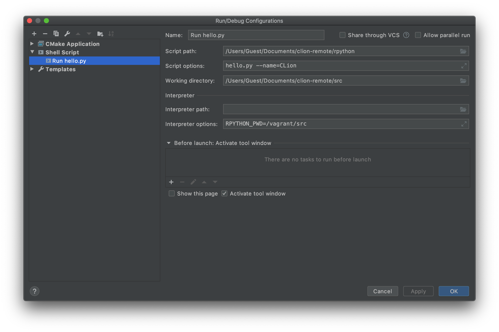

################################################
Remote Python Development With CLion and Vagrant
################################################

.. _Vagrant: https://www.vagrantup.com
.. _Vagrant support: https://youtrack.jetbrains.com/issue/CPP-7671
.. _rpython: rpython
.. _README: README.rst

.. _CPP-5681: https://youtrack.jetbrains.com/issue/CPP-5681
.. _CPP-13470: https://youtrack.jetbrains.com/issue/CPP-13470

CLion supports local development development with Python but does not have the
remote development support found in PyCharm (see feature requests `CPP-5681`_
and `CPP-13470`_). However, it can be configured to run remote Python commands
by using the `rpython`_ helper script.

=====================
Project Configuration
=====================

The project should be configured as described in the `README`_. The remote
Toolchain is not required here, but the the remote Deployment is needed to
sync files to the Vagrant VM. Once the local project directory has been synced
the remote `rpython`_ script must be made executable.

|chmod|

===============
Remote Workflow
===============

.. _Shell Script: https://www.jetbrains.com/help/clion/shell-scripts.html

`Shell Script`_ run configurations can be used to execute ``rpython`` on the
Vagrant VM. Use the *Interpreter options* to configure the script using
environment variables; the *Interpreter path* **must** be blank for this to
work. The *Script options* will be passed to the remote ``python`` command.

|hello-python|

Once configured, remote Python commands can be easily run from the IDE without
logging in to the Vagrant VM. This is strictly for convenience as the remote
Python interpreter cannot be used for code assistance or debugging.

|run-python|
